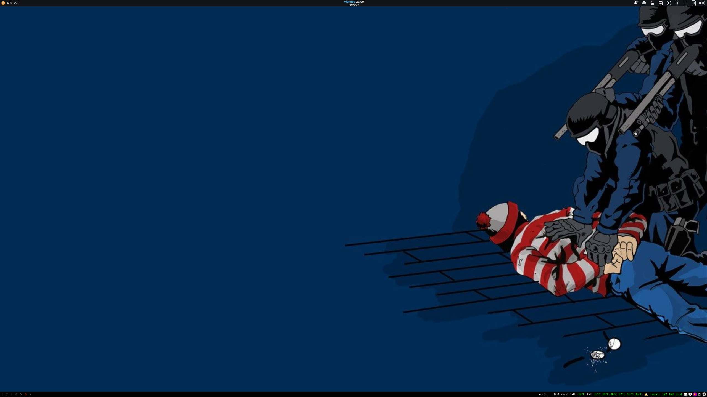

<h1 align="center"> Mis DotFiles</h1>

LastEdit : Jul/2023

# ¿Que puedes encontrar Aqui?
Aqui encontraras distintas configuraciones para distintos entornos, Todos creados por mi. y con configuraciones varadas.

# EN CONSTRUCCION

<h1 align="center"> I3WM + KDE [PY3STATUS]</h1>

<h1 align="center"> HYPERLAND [WAYBAR]</h1>
No recomiendo utilizar Hyprland (Wayland) Si tienes una tarjeta grafica Nvidia.

<h1 align="center"> XMONAD [XMOBAR]</h1>

